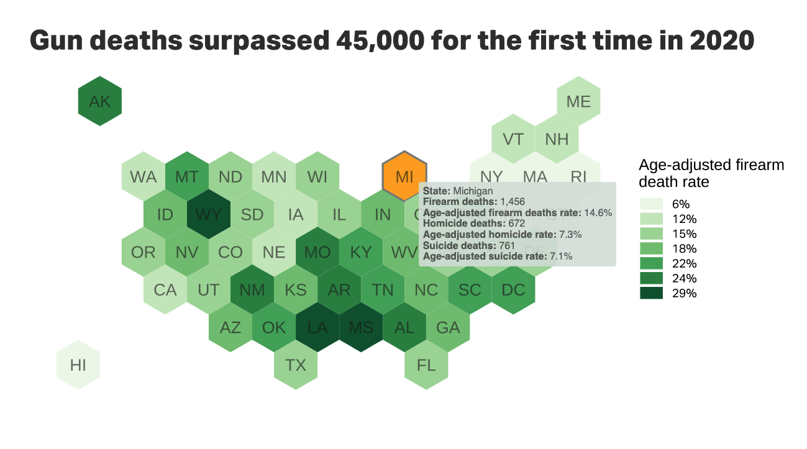

## Load packages

```{r}
#| label: setup
#| warning: false
#| message: false

library(tidyverse)
library(babynames)
library(scales)
```

## Load data

The [babynames](https://github.com/hadley/babynames) data has the number of children of each sex given each name for each year from 1880 to 2017. All names with more than 5 uses are given.

```{r}
data <- babynames
```

## What is ggplot2?

The package ggplot2 allows us to create a number of visualizations with tremendous flexibility and customization.  Because it is open source, its capabilities are expanded all the time by a community around the world.

### ggplot examples




## Let's make a bar chart

For this first chart, let's make a bar chart.

### Preparing our data

We'll start by getting our data ready. We filter by the latest year then get the 10 most popular based on the count "n".

```{r}
bar_chart_data <- data |> 
  filter(year == 2017) |>
  slice_max(n, n = 10)

bar_chart_data |> arrange(sex, name)
```

### Build plot in layers

Now we want to make a plot.

First, let's create a blank canvas

```{r}
data |> ggplot()
```

Now let's add x and y dimensions to our canvas.

```{r}
bar_chart_data |> 
  ggplot(aes(x = name,
             y = n)) 
```

Now we need to add something called a 'geom'. This determines what kind of chart will get added to our canvas.

```{r}
bar_chart_data |> ggplot(
    aes(x = name, y = n)
  ) +
  geom_col()
```

This is not really how we want this to look. First, let's order the bars by n.

```{r}
bar_chart_data |> ggplot(
    aes(x = reorder(name,desc(n)), y = n)
  ) +
  geom_col()
```

### Make adjustments

That's getting a bit better, but that color is bland!

In R, we can use a selection of named colors, or any hex value. Alpha is transparency.

```{r}
bar_chart_data |> ggplot(
    aes(x = reorder(name,desc(n)), y = n)
  ) +
  geom_col(fill = "cadetblue", alpha = .8)
```

Looking better, but I don't love the y-axis. Let's add commas to the tick mark labels.

```{r}
bar_chart_data |> ggplot(
    aes(x = reorder(name,desc(n)), y = comma(n))
  ) +
  geom_col(fill = "cadetblue", alpha = .8)
```

Now let's get rid of that ugly background, those axis labels, and add a title to our chart.

```{r}
bar_chart_data |> ggplot(
    aes(x = reorder(name,desc(n)), y = comma(n))
  ) +
  geom_col(fill = "cadetblue", alpha = .8) +
  labs(
    title = "The 10 most common baby names in 2017",
    subtitle = "None of these are Heaven spelled backwards."
  ) +
  theme_minimal() +
  theme(axis.title = element_blank())
```

We can even layer geoms.

```{r}
bar_chart_data |> ggplot(
    aes(x = reorder(name,desc(n)),
        y = comma(n))
  ) +
  geom_col(fill = "cadetblue", alpha = .8) +
  labs(
    title = "The 10 most common baby names in 2017",
    subtitle = "None of these are Heaven spelled backwards.",
    caption = "Source: Social Security Administration\nby Olga Pierce"
  ) +
  theme_minimal() +
  theme(axis.title = element_blank(),
        axis.text.y = element_blank(),
        panel.grid.major = element_blank(),
        panel.grid.minor = element_blank()) +
geom_text(aes(label = comma(n)), vjust = -0.5)
```

Some of these are characterized as male names and some as female.  What if we want to color code them?

```{r}
bar_chart_data |> ggplot(
    aes(
      x = reorder(name,desc(n)),
      y = comma(n),
      fill = sex)
  ) +
  geom_col(alpha = .8) +
  labs(
    title = "The 10 most common baby names in 2017",
    subtitle = "None of these are Heaven spelled backwards.",
    caption = "Source: Social Security Administration\nby Olga Pierce"
  ) +
  theme_minimal() +
  theme(axis.title = element_blank(),
        axis.text.y = element_blank(),
        panel.grid.major = element_blank(),
        panel.grid.minor = element_blank()) +
geom_text(aes(label = comma(n)), vjust = -0.5)
```

Those colors are kinda problematic, let's pick our own.

```{r}
bar_chart_data |> ggplot(
    aes(x = reorder(name,desc(n)),
        y = comma(n),
        fill = sex)
  ) +
  geom_col(alpha = .8) +
  labs(title = "The 10 most common baby names in 2017", subtitle = "None of these are Heaven spelled backwards.", caption = "Source: Social Security Administration\nby Olga Pierce") +
  theme_minimal() +
  theme(axis.title = element_blank(),
        axis.text.y = element_blank(),
        panel.grid.major = element_blank(),
        panel.grid.minor = element_blank()) +
geom_text(aes(label = comma(n)), vjust = -0.5) +
scale_fill_manual(values=c("#756bb1", "#2ca25f"))
```

### Your turn: Bar chart

Make a bar chart of your own. You can work together in pairs, if you like.

You might filter for your name, then arrange to find which years had the most uses or highest percentage, then chart the top years with by count or proportion.

```{r}

```

## Let's make a line chart

### Get list of top names

Here we build a list of the most popular girls names since 2010 (but you can change the time period).

```{r}
top_girls_names <- data |> 
  filter(
    sex == "F",
    year >= 2010 # you could change this to a different time period
  ) |> 
  group_by(name) |> 
  summarise(total_names = sum(n)) |> 
  arrange(desc(total_names)) |> 
  slice_head(n = 5) |> # gets the top 5
  pull(name) # pulls the name column into a list

top_girls_names
```

### Filter data to our list

Here we filter the names for just girls, but then also the list of the top girls names.

I've separated the filters so you could instead make a list of specific names, if you want. Just swap the comment and edit the list.

```{r}
line_chart_data <- data |>
  filter(sex == "F") |>
  filter(
    # name %in% c("Taylor", "Mariah", "Kelly", "Emma", "Victoria", "Beyonce"),
    name %in% top_girls_names
  )

line_chart_data
```

### Build the chart layers

Now we'll set up our canvas

```{r}
line_chart_data |>
  ggplot(aes(x = year, y = prop))
```

And now we'll add lines
```{r}
line_chart_data |> 
  ggplot(aes(x = year, y = prop, color = name)) +
  geom_line() +
  theme_minimal()
```

Let's do some cosmetic changes

```{r}
line_chart_data |> 
  ggplot(aes(x = year, y = prop, color = name)) +
  geom_line() +
  scale_y_continuous(labels = scales::percent) +
  scale_x_continuous(breaks = seq(1900,2017,10)) +
  theme_minimal() +
  theme(axis.title = element_blank()) +
  labs(
    title = "My awesome chart title",
    subtitle = "Names as a percentage of all births",
    color = "Baby name"
  )
```

And here's an alternative version

```{r}
line_chart_data |>
  ggplot(aes(x = year, y = prop, color = name, fill = name)) +
  geom_density(stat = "identity", alpha = .5) +
  theme_minimal()
```

### Faceting

Data prep: We won't get into this code, but it finds the top 20 most popular baby names over time and then uses that list to pare the original data back to only the records of those 20 names.

```{r}
top_names <- data |> group_by(name) |> summarize(total = sum(n)) |> arrange(desc(total)) |> slice_head(n = 20) |> pull(name)

top_names

facet_names_data <- data |> filter(name %in% top_names)
```

```{r}
facet_names_data |> filter(name == "Joseph")
```

And now the chart

```{r}
facet_names_data |> ggplot(aes(x = year, y = prop, color = name)) +
  geom_line() +
  scale_y_continuous(labels = scales::percent) +
  scale_x_continuous(breaks = seq(1900,2017,40)) +
  theme_minimal() +
  theme(legend.position = "none") +
  facet_wrap(vars(name), ncol = 5)
```

### Your turn: Line chart

Make a rad line chart. Work in pairs if you like.

You might start with the data `applicants`, which is the number of applicants for social security numbers (SSN) for each year for each sex?

```{r}

```

