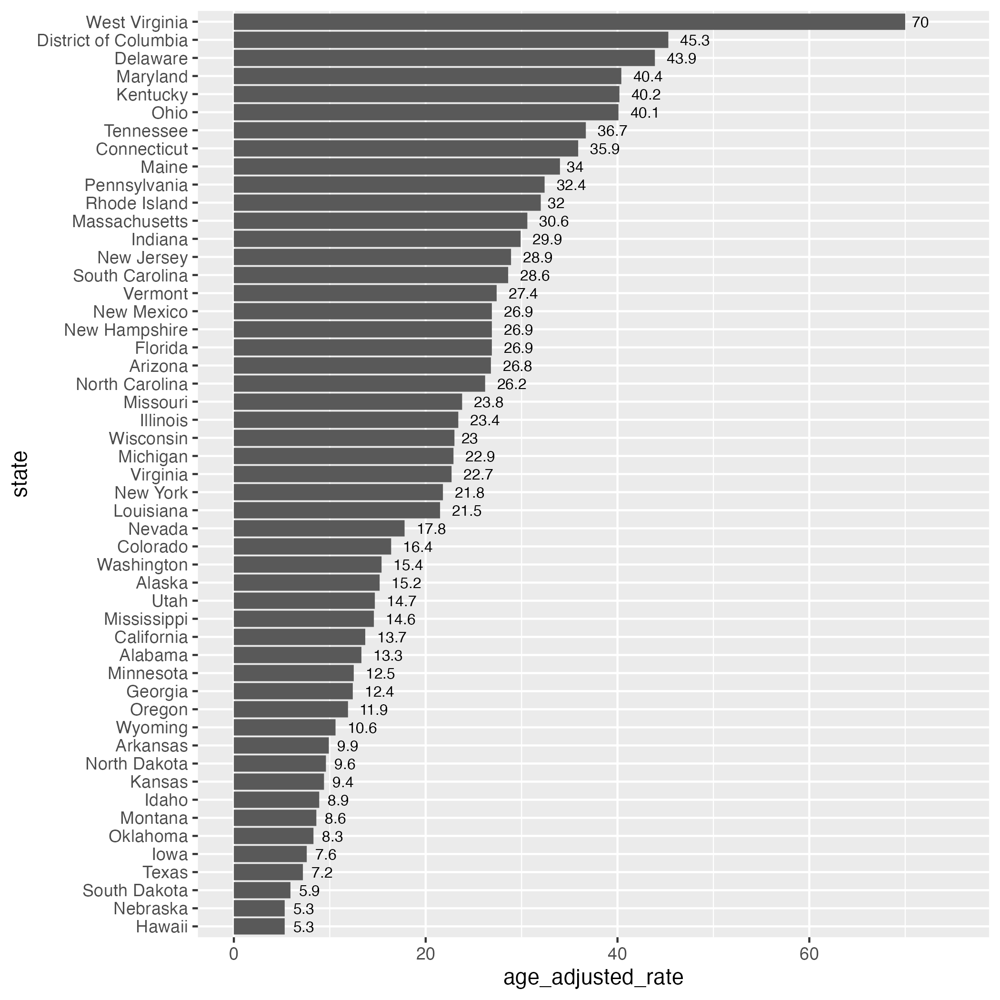

## Setup

The tidyverse library includes most functions, but we'll call the scales library directly later.

```{r}
library(tidyverse)
```

Three different datasets to illustrate various graphic options.

```{r}
dispatch <- read_csv("../data/dispatch.csv")
mlb <- read_csv("../data/mlb.csv")
opioids <- read_csv("../data/opioid-deaths.csv")
```

We'll start by trying out some different geoms:

## One variable (continuous)

**MLB**

```{r}
ggplot(mlb, aes(salary)) +
  geom_area(stat="bin")
```

```{r}
ggplot(mlb, aes(salary)) +
  geom_area(stat="bin", bins = 40)
```

```{r}
ggplot(mlb, aes(salary)) +
  geom_histogram()
```

```{r}
ggplot(mlb, aes(salary)) +
  geom_histogram(bins = 10, color = 1, fill = 2) +
  scale_x_continuous(labels=scales::dollar_format())
```

```{r}
ggplot(mlb, aes(salary)) +
  geom_histogram(bins = 10, color = 1, fill = 2) +
  scale_x_continuous(labels=scales::dollar_format()) +
  facet_wrap(~team)

```

## One variable (discrete)

**dispatch**

```{r}
dispatch %>% ggplot(aes(x=DOW)) +
  geom_bar()

# in order for the days of the week to appear in the right order, we need to turn that column into a factor:
dispatch %>% mutate(DOW = fct_relevel(DOW,
                                      "Sunday", "Monday", "Tuesday", "Wednesday", 
                                      "Thursday", "Friday", "Saturday")) %>% 
  ggplot(aes(x=DOW)) +
  geom_bar()
```

## Two variables (both continuous)

**opioids**

```{r}
# first look at the unaggregated dataset:
opioids %>% ggplot(aes(x=year, y=deaths)) +
  geom_point()

# might be easier to see total deaths by year and then graph it:
d1 <- opioids %>% group_by(year) %>% summarise(deaths = sum(deaths, na.rm=T))

d1 %>% ggplot(aes(x=year, y=deaths)) +
  geom_point()

# or you could use something like geom_smooth():
opioids %>% ggplot(aes(x=year, y=deaths)) +
  geom_smooth()

```

What we really want to do is look at the age adjusted rate, but we can't aggregate over it, but we can look at one state at a time:

```{r}
opioids %>%
  filter(state=="Missouri") %>% 
  ggplot(aes(x=year, y=age_adjusted_rate)) +
  geom_smooth()
```

Or use facets to compare all states:

```{r}
opioids %>%
  ggplot(aes(x=year, y=age_adjusted_rate)) +
  geom_smooth() +
  facet_wrap(~state)
```

## Two variables (one continuous one discreet)

**opioids**

```{r}
# create the dataset you need (age-adjusted death rate for all states in 2020)
d2 <- opioids %>% filter(year==2020) %>% drop_na(age_adjusted_rate)

d2 %>% 
  ggplot(aes(x=state,y=age_adjusted_rate)) +
  geom_col()
```

Let's try that again but reordering the states and changing the orientation of the labels:

```{r}
d2 %>% 
  mutate(state = fct_reorder(state, age_adjusted_rate)) %>% 
  ggplot(aes(x=state,y=age_adjusted_rate)) +
  geom_col() +
  theme(axis.text.x = element_text(angle = 90, vjust = 0.5, hjust=1))
```

### Flip and save

Or flip it. One challenge with this is ggplot will try to render the chart based on the available space on your screen, often squishing it. One way around this is to save your plot into an R object, then immediately save it as a file with `ggsave()` to your project. You can then show that saved png in your notebook without being squished.

We've also added text labels here with the values and adjusted them to fit.

```{r}
opioids_age <- d2 %>% 
  mutate(state = fct_reorder(state, age_adjusted_rate)) %>% 
  ggplot(aes(x=state,y=age_adjusted_rate)) +
  geom_col() +
  geom_text(aes(label = age_adjusted_rate), hjust = -.4, size = 2.7) +
  ylim(0,75) +
  coord_flip()

ggsave("images/opioids_state.png")
```



## Do your own thing

```{r}

 
```
