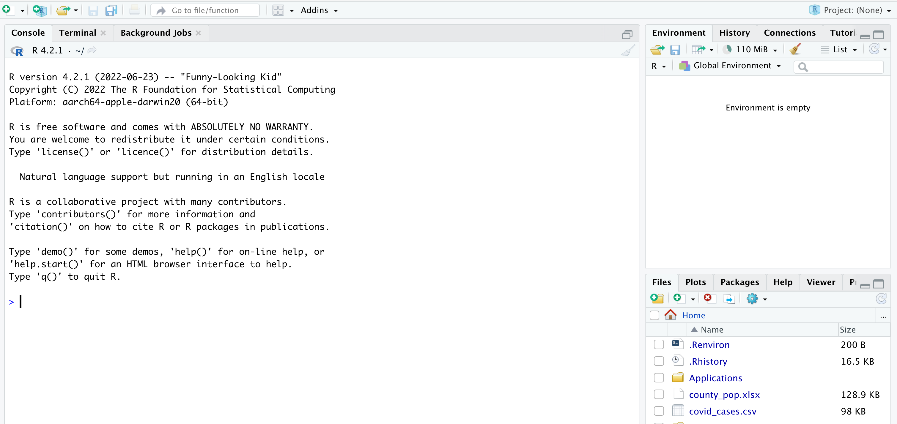
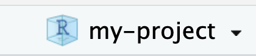

### Part One: Getting familiar with RStudio and Notebook files

RStudio is your dashboard for working with R: writing scripts, viewing variables, even reading documentation on the fly

When you open RStudio, you see the window is divided into sections



On the left is the **Console**, where you can write and run code. When you start writing code in script files it will reflect the code you've run. It also tells you what version of R you are running. When you create or open script files, they will appear above the Console, pushing it to the lower-left quadrant.

The upper-right quadrant has several tabs, the first of which is **environment**: if you store any information in variables (such as a table of data), they will show up there.

The lower-right quadrant also has several tabs, the first of which is Files: it shows what files exist in your current working directory, which is usually your root directory when you first open RStudio. We will change this later.

We encourage the use of **Notebook** files (.Rmd), which enable you to both write comments (which is what I'm writing here what I'm writing here) and to write code, in what we call a **code chunk**:

```{r}
x <- "Hello, World!"
print(x)
```

In notebook files, the results of the code in each code chunk will print below the chunk, allowing you to quickly see the results of your work. The utility of this will be apparent when we start asking questions of data.

You create a code chunk by typing `cmd+option+i` and you write your `code` in between the first and last lines of the code chunk. All your comments, questions, thoughts, and notes are written outside of the code chunks. The comments outside of code chunks use markdown for formatting. Markdown is similar to html, but if you don't know it, don't worry about it for now.

You can create a notebook file (.Rmd) by clicking the little green plus sign in the upper left, and selecting **R Notebook** from the dropdown menu:

{width="223"}

### Part Two: Project setup

Before you start creating files, let's talk organization. With a language like R, it will make your life easier if you keep all your files in a consistent structure and use R project files. Use this setup for every project you undertake with R, whether it's this class or data analysis for your next story.

1.  **Create a folder for the project.** Name it something that makes sense, with no spaces, such as "my-project" (but be more specific than that). Put it somewhere on your computer, such as the Documents folder. It's best not to put it in your root directory, which is `/Users/username` for Macs and usually `C:\Users\username` on Windows computers. If you have OneDrive on your computer, avoid putting these files on OneDrive if at all possible; it tends not to work well.
2.  **Create an R project file**. Go to File \> New Project, and in the window that pops up choose "Existing Directory" (because you just created it. Remember, directory basically means folder). Click "Browse" and navigate to the folder you just created. Then click "Create Project." RStudio will then reload. Notice that your folder name now shows up in the very upper right-hand corner of RStudio {width="96"} . Also, your Files window (bottom right) has now changed to your project folder. You'll see the .Rproj file you just created.
3.  Every time you plan to work on this project, havigate to your project folder through Finder (Macs) or Windows Explorer (Windows) and start by double-clicking on the .Rproj file, which will open up RStudio. This .Rproj file sets your **current working directory**, which is the folder on your computer where R is pointed. By default it is pointed at your root directory, but each .Rproj file changes the working directory to your project folder. This makes your life a lot easier as you read in data.

### Part Three: Learning terminology

Some important terminology has come up already:

-   **Notebook**: a certain type of R script that allows us to write whatever text we want, including `code` inside of code chunks
-   **code chunk**: created by typing `cmd+option+i`, type your code inside code chunks.
-   **environment**: this is basically your workspace for every R session. It's empty until you start storing information in variables.
-   **variable**: a variable is a container that holds something. For example, the following code stores the word "spaghetti" into a variable named "x", using the assignment operator `<-`, and then prints the contents of that variable to the console below the code chunk:

```{r}
x <- "spaghetti"
print(x)
```

In the example above, "spaghetti" is a string of text, or characters. You can also store numbers in variables (numbers do not require double quotes):

```{r}
y <- 3
```

Naming variables: you can use letters, numbers, underscores and dots

| Variable Name | Validity | Reason                                                    |
|-------------------|-------------------|-----------------------------------|
| var_name2.    | valid    | has letters, numbers, underscore, dot                     |
| .var_name     | valid    | can start with a dot (but not a dot followed by a number) |
| var_name%     | invalid  | has the character '%' (not allowed)                       |
| 2var_name     | invalid  | starts with a number                                      |
| .2var_name    | invalid  | cannot start with a dot and a number                      |
| \_var_name    | invalid  | cannot start with underscore                              |

-   **data types**:
    -   `chr` (character): commonly referred to as a string; can be letters, numbers, punctuation, etc. Always enclosed in "double quotes".
    -   `int` (integer): a whole number, such as `1`, `5`, `10000`. No decimal places.
    -   `dbl` or `num` (number): a number that can have decimal places, such as `5.2` or `100.37`
    -   `POSIX` or `dttm` (datetime): dates (always formatted `yyyy-mm-dd`) and times
    -   `logi` (logical): either `TRUE` or `FALSE` (not quoted)
    -   complex: e.g. `3 + 2i` (we won't use this)
    -   raw: (won't use this either)
-   **vector**: this is a common feature of R that you will use regularly. A vector is a series of values. Vectors can only store elements of the same data type, for example all strings or all numbers, and are created with the `c()` **function**:

```{r}
x <- c("spagetti sauce", "noodles", "parmesan")
y <- c(1,2,3)
```

-   **function**: these are the backbones of all analysis, in any program (from spreadsheets to database managers to programming languages). Every function has a particular structure and does a particular thing. The structure is: `function_name(arguments)`. For example, the `sum()` function works in R the same way it works in other programs:

```{r}
x <- 1
y <- 2
sum(x,y)
```

-   **pipe**: a pipe does what it sounds like: it pipes information from one function to the next. It is a part of the [tidyverse](https://www.tidyverse.org/) **package**, which is the primary set of tools we use for data analysis in R. You will use the pipe a lot, and it looks like this: `%>%`. A shortcut for typing it is `cmd+shift+m` (or `ctrl+shift+m`).
-   **package**: a set of features and functions that are not a part of base R (what you initially installed), but that you can add to R to increase its functionality. You install packages once by using the `install.packages()` function. Then every time you want to use a package (such as tidyverse) in your script, you load it into your environment using the `library()` function.

### Part Four: The key to understanding programming...

This might be an overstatement, but it *is* very important. It's critical to understand, when coding, how **information is passed around**. For the sake of this class, let's refer to information as **data**, although it won't always be tabular. Data can be stored in a variable or printed to the **console** (which is directly below a code chunk in R Notebooks). Data stored as a variable shows up in the environment, and can be referred to later in your script.

Additionally, data can be passed (or **piped**) through functions that filter, sort, aggregate, and/or mutate it in some way. But it will always end up either printing to the console or being stored in a variable.

### Part Five: Time to write some code

Now that you're in your new project file, you can create a new notebook file. Click the green plus sign and choose R Notebook:

{width="223"}

You'll notice that it comes with some code already written out. There are instructions about how to run code, create code chunks, and there's even some sample code you can run. To run it click the green "play" button in the upper-right corner of a code chunk. You can also run individual lines of code in a code chunk by putting your cursor on that line and typing `cmd + return` (or `ctrl + enter` on a PC).
